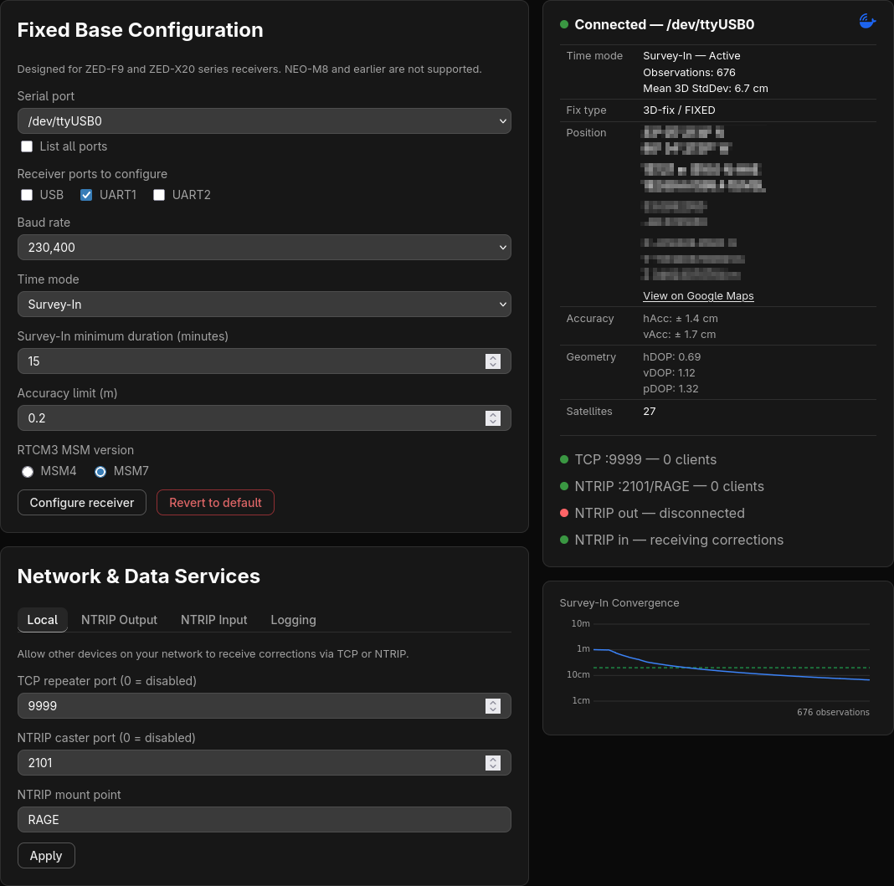

# Dock of the Base

Docker-based GNSS fixed base station configuration for u-Blox GNSS receivers.

Designed for use with ZED-F9-series and ZED-X20-series receivers.

Provides a web app and persistent serial connection to the base station receiver, along with various network services to forward RTCM3 data to rover receivers.

## INSTALLATION

Requires [Docker](https://docs.docker.com/engine/install/) with the Compose plugin.

> NOTE: This app is untested on Windows. Docker Desktop does not support USB device passthrough; however, running Docker under WSL2 with [usbipd-win](https://github.com/dorssel/usbipd-win) should work. See the [usbipd-win documentation](https://learn.microsoft.com/en-us/windows/wsl/connect-usb) for setup instructions.

Run the installer:

```bash
mkdir -p dock-of-the-base
cd dock-of-the-base
curl -sS https://raw.githubusercontent.com/yuri-rage/dock-of-the-base/master/install.sh | bash
```

Start the service:

```bash
docker compose up -d
```

The image will be pulled from Docker Hub automatically on first run. Navigate to `http://<host-ip>:8765` to access the web interface.

To stop the service:

```bash
docker compose down
```



## QUICK START

- Connect the receiver to the host via USB or UART/serial port.
- Navigate to `http://<host-ip>:8765` using a web browser on the same local network.
  - ([http://localhost:8765](http://localhost:8765) if accessing on the host machine)
- Choose the hardware serial port on which the receiver is connected.
  - (often `/dev/ttyUSB0` or `/dev/ttyACM0`)
  - The device list is automatically filtered to include only the most common devices. If your device is not listed, click "List all ports" below the device selection dropdown.
- Select the receiver's ports to configure
  - (typically USB and/or UART1)
- Choose the baud rate
  - (recommend 230,400)
- Choose "Fixed" under "Time mode," and enter antenna location data.
- Click "Configure receiver" to save the settings and connect to the receiver.
- Once configured, RTCM3 message counts by type are displayed in the status pane. A heartbeat indicator pulses with each status update to confirm the app is running normally.

> NOTE: If the receiver was previously configured, it's best to reset it before configuring (click "Revert to default").

## SURVEY-IN

- Follow "Quick Start" above, but choose "Survey-In" under "Time mode" instead.
- Configure the desired duration and accuracy limit
  - (typically at least 15 minutes and 1m accuracy - longer is better)
- Click "Configure receiver" to save the settings and connect to the receiver.
- Optionally, connect to an external NTRIP service to improve convergence by entering the NTRIP caster details under "Network & Data Services" / "NTRIP Input."

> NOTE: A self-survey may be canceled at any time by selecting "Fixed" mode. An option to use the current survey state location/accuracy will be presented.

> NOTE: Survey-In is typically a one-time operation. Once complete, save the result as Fixed mode - the base station will use those coordinates on every subsequent boot without re-surveying.

> NOTE: A self-survey's _absolute_ accuracy is typically only 1-2 meters, even when the reported standard deviation converges much finer. This does not affect rover _repeatability_: all RTCM corrections are relative to the fixed base position, so rovers will return to saved waypoints with cm-level consistency regardless of absolute accuracy, as long as the base station coordinates do not change. For applications requiring absolute geodetic accuracy, have the antenna location professionally surveyed or use PPK post-processing.

## NETWORK & DATA SERVICES

The web app provides multiple options for configuring local and external network services, along with data-logging.

> NOTE: This app is designed for use on a trusted local network. NTRIP credentials are stored in plaintext - do not expose the container's port to the internet. To share corrections with external services, use the NTRIP Output feature instead.

**Local network services:**

- A TCP repeater that forwards all serial data between the receiver and connected clients. It can be used to connect [u-Center software](https://www.u-blox.com/en/product/u-center) for real-time monitoring or advanced configuration.
- A local NTRIP caster for RTCM3 forwarding within the local network.

**NTRIP Output:**

- If pushing corrections to an external service, such as [RTK2Go](https://www.rtk2go.com/) or [GeoAstra](https://www.geoastra.com/), is desired, configure the "NTRIP Output" section with credentials and external caster details.

**NTRIP Input:**

- Used for receiving corrections from an external NTRIP caster during Survey-In. NTRIP input is disabled in Fixed mode, as it is not applicable when the base station is providing corrections.

> NOTE: Sending GGA messages is only required for VRS or NRS mount points (typically included in the mount point name, e.g., `SOME_NTRIP_SOURCE_VRS`).

**Logging:**

- Configure logging options to capture raw GNSS observation data for PPK post-processing or other analysis. Recommend using 30 second observation intervals to keep log file sizes from growing very large.
- The produced .ubx log files contain `RAWX` and `SFRBX` UBX messages.
- For convenience, completed .ubx log files are automatically converted to RINEX .obs and .nav files using `convbin` from [RTKLIB](https://github.com/tomojitakasu/RTKLIB).

> NOTE: When using Docker, log files on the host will be owned by `root`. They can be managed (downloaded or deleted) via the web interface.

## POST-PROCESSING

- Download the .obs file from the web interface and upload it to [OPUS](https://geodesy.noaa.gov/OPUS/) for post-processing. Aim for at least 2 hours of data; waiting 24+ hours after collection helps ensure CORS coverage.
  - Antenna selection affects primarily vertical accuracy - use the actual model when available, or the closest match. For example, TPSCR.G3 TPSH is a reasonable match for the all-band survey antenna sold by [gnss.store](https://gnss.store/products/elt0123).
- The generated .nav file can be used alongside the .obs file in tools such as [RTKLIB](https://github.com/tomojitakasu/RTKLIB). It's also helpful (in the US) to download CORS data from [NGS UFCORS](https://geodesy.noaa.gov/UFCORS/) when post-processing with RTKLIB.
